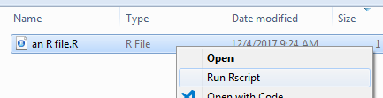
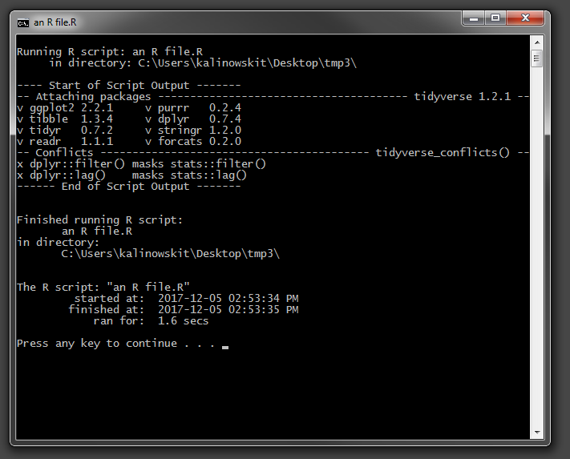
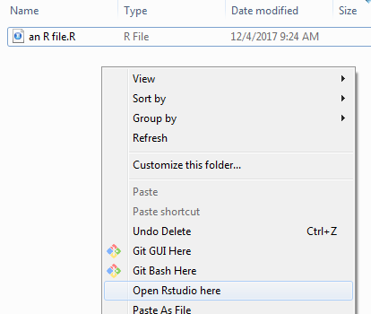

# windows

`windows` is an R package that allows you easily:

+   add R and Rscript to the PATH
+   add a right click context menu action "Run R script", which runs the R script with in a fresh and isolated R session, then gives you some information after it's done running. (see screenshots) 

 

Clicking on"Run Rscript" brings up:

 

the R file is executed via  `Rscript --vanilla` in a separate isolated session. In this example, the script shown consists solely of `library(tidyverse)`). The timer and other information is added by the context menu.


+   add a right click context menu action "Open Rstudio here" 




Tested on windows 7 and windows 10. 

to install:
``` r
devtools::install_github("t-kalinowski/windows")
```

to use:
``` r
add_R_to_path()
add_open_Rstudio_here_right_click_context_action()
add_run_R_script_right_click_context_action()
```
